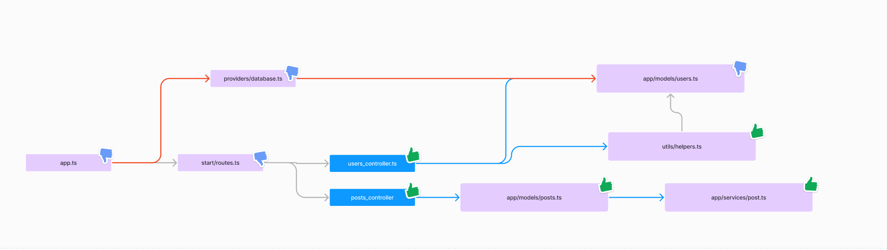

# Hot Hook

Hot Hook is a simple and lightweight library for adding hot module replacement in NodeJS with ESM.

You know how in frameworks like React or VueJS, you edit a file and the page updates automatically without needing to refresh? Well, it's the same concept but for NodeJS.

Take an Express server, for example. The most common development process involves watching the entire project with tools like nodemon and restarting the whole server whenever a file changes. With Hot Hook, you no longer need to restart the entire server; you can make it so only the changed module/file is reloaded. This provides a much faster DX and feedback loop.

The library is designed to be very light and simple. It doesn't perform any dark magic, no AST parsing, no code transformation, no bundling. It just reloads the changed module. 

## Installation

> [!TIP]
> If you're using AdonisJS, Hono, or Fastify, we have examples in the examples folder to help you set up Hot Hook in your application.

```bash
pnpm add hot-hook
```

### Initialization

You have two ways to initialize Hot Hook in your application.

### Using `--import` flag

You can use the `--import` flag to load the Hot Hook hook at application startup without needing to use `hot.init` in your codebase. If you are using a loader to transpile to TS (`ts-node` or `tsx`), Hot Hook must be placed in the second position, after the TS loader otherwise it won't work.

```bash
node --import=tsx --import=hot-hook/register ./src/index.ts
```

To configure boundaries and other files, you'll need to use your application's `package.json` file, in the `hot-hook` key. For example: 

```json
// package.json
{
  "hotHook": {
    "boundaries": [
      "./src/controllers/**/*.tsx"
    ]
  }
}
```

Note that glob patterns are resolved from the `package.json` directory.

Or you can still use the `import.meta.hot?.boundary` attribute in your code to specify which files should be hot reloadable.

### Using `hot.init`

You need to add the following code as early as possible in your NodeJS application.

```ts
import { hot } from 'hot-hook'

await hot.init({
  root: import.meta.filename,
  // options
})
```

The `hot.init` function internally call [`register`](https://nodejs.org/api/module.html#moduleregisterspecifier-parenturl-options) from `node:module` to hook into the module loading process. This is why you need to call it as early as possible, otherwise modules imported before the call to `hot.init` will not benefit from hot module replacement.

Next, you need to include the types for `import.meta.hot` in your project. To do this, add the following code in a `.d.ts` file or in the `types` property of your `tsconfig.json`.

```ts
/// <reference types="hot-hook/import-meta" />
```

```json
{
  "compilerOptions": {
    "types": ["hot-hook/import-meta"]
  }
}
```

## Usage

Once Hot Hook is initialized in your application. Every time you want HMR working for a specific module and their dependencies, you need to dynamic import (`await import`) the module and make sure this `await import` is called often enough to reload the module when needed.

In the case of an HTTP server, you would typically dynamic import your controller or route handler module. So every time a request is made, Hot Hook will be able to reload the module (and its dependencies) if it has changed. 

Also note that you must use `import.meta.hot?.boundary` when importing the module. This is a special [import](https://nodejs.org/api/esm.html#import-attributes) attributes that allows to create what we call an [HMR boundary](#boundary).

> [!TIP]
> If using `import.meta.hot?.boundary` is not of your taste, you can also hardcode the list of files that you want to be hot reloadable using glob patterns in the [`boundaries` options of `hot.init`](#boundaries)

Example :

```ts
import * as http from 'http'

const server = http.createServer(async (request, response) => {
  const app = await import('./app.js', import.meta.hot?.boundary)
  app.default(request, response)
})

server.listen(8080)
```

This is a simple example, the `app.js` module will always be reloaded with the latest version every time you modify the file and make a new request. However, the http server will not be restarted.

We have some examples in the examples folder with different frameworks to help you set up Hot Hook in your application. If you are using [AdonisJS](https://adonisjs.com/): it's your lucky day. Hot hook was the reason why I created this library and we gonna have a complete integration with AdonisJS soon.

## Options

`hot.init` accepts the following options:


### `root`

The path of the root file. This is the entry point of your application. Glob patterns are resolved from the directory of this file.

```ts
await hot.init({
  root: import.meta.filename
})
```

### `ignore`

An array of glob patterns that specifies which files should not be considered by Hot Hook. That means they won't be reloaded when modified. By default, it's `['node_modules/**']`.

### `boundaries`

An array of glob patterns that specifies which files should be considered as HMR boundaries. This is useful when you don't want to use `import.meta.hot?.boundary` in your code.

```ts
await hot.init({
  boundaries: [
    './app/**/controllers/*.ts'
  ]
})
```

## API

### import.meta.hot

The `import.meta.hot` variable is available if you need to condition code based on whether hot-hook is enabled or not.

```ts
if (import.meta.hot) {
  // Specific code that will use import.meta.hot
}
```

Or simply use optional chaining:

```ts
import.meta.hot?.dispose()
```

### import.meta.hot.dispose()

`import.meta.hot.dispose` is a function that allows you to specify code that should run before a module is reloaded. This can be useful for closing connections, cleaning up resources, etc.

```ts
const interval = setInterval(() => {
  console.log('Hello')
}, 1000)

import.meta.hot?.dispose(() => {
  clearInterval(interval)
})
```

Here, each time the module is reloaded, the `interval` will be cleaned up.

### import.meta.hot.decline()

`import.meta.hot.decline` is a function that allows you to specify that the module should not be reloaded. This can be useful for modules that are not supposed to be hot reloaded, like configuration files.

```ts
import.meta.hot?.decline()

export const config = {
  port: 8080
}
```

If this file is modified, then hot hook will call the `onFullReloadAsked` function, which you can specify in the options of `hot.init`. Otherwise, by default it will just send a message to the parent process to reload the module.

## How it works ?

First, let's start by explaining the basics.

### What is a hook ? 

Hot Hook is a [hook](https://nodejs.org/api/module.html#customization-hooks) for Node.js. In short: a hook is a way to intercept the loading of a module. Every time you do an import in your code, Hot Hook can intercept this and perform additional actions like injecting or transforming the module's imported code, recording information about the module, etc.

### ESM Cache busting

Once you use an import, Node.js loads the module into memory and keeps it in cache. This means that if you import the same module multiple times in your application, Node.js will load it only once throughout the application's lifetime.

This is problematic for hot module replacement.

Previously, with CommonJS (require), we had control over this Node.js cache. We could remove a module from the cache (`delete require.cache`), and thus a require on this module would force Node.js to fetch the latest version of the module.

So, how do we do this in ESM? There have been lots of discussions on this topic for a while (https://github.com/nodejs/node/issues/49442, https://github.com/nodejs/help/issues/2806). But for now, there's no official solution. However, there is a trick. A trick that causes memory leaks, but they are so minimal that it shouldn't be a problem for most applications. Especially since we use this trick ONLY in development mode.

This trick is what Hot Hook uses to do hot module replacement. And it simply involves adding a query parameter to the URL of the imported module. This forces Node.js to load again the module, thus getting the latest version of the module.

```ts
await import('./app.js?v=1')
await sleep(5_000)
await import('./app.js?v=2')
```

If you execute this code, and modify the app.js file between the two imports, then the second import will load the latest version of the module you've saved.

### Boundary

"HMR boundaries" are an important concept in Hot Hook. The so-called "boundary modules" are modules that are marked as being hot reloadable using the `import.meta.hot?.boundary` attribute during their importation (or using the `boundaries` configuration in your `package.json`) :

```ts
await import('./users_controller.js', import.meta.hot?.boundary)
```

> [!TIP]
> One important thing to note is, ONLY dynamic imports can be hot reloadable. Static imports will not be hot reloadable so don't declare them as boundaries. Read more about this [here](#esm-cache-busting).

By importing a module this way, you are essentially creating a kind of boundary. This module and all the modules imported by it will be hot reloadable.

Let's take a more complete example. Essentially, Hot Hook has a very simple algorithm to determine whether the file you just edited is hot reloadable or not.

- Starting from the modified file, Hot Hook will go up the whole dependency tree until it can reach the root file (the entry point of the application/the executed script).
- If Hot Hook can reach the root file without encountering any boundary file, then it means we need to do a full reload of the server.
- If all paths to reach the root file go through boundary files, then it means we can hot reload the modified file.

Example with this typical tree diagram of an HTTP application:



In this example, `users_controller.ts` and `posts_controller.ts` are boundary files. If you modify one of these two files, then Hot Hook can hot reload them. Now let's consider other cases.

- `app/models/posts.ts`. It is hot reloadable, because the only path to reach the root file goes through `posts_controller.ts`, which is a boundary file.
- The same goes for `app/services/post.ts`.
- `utils/helpers.ts` is also hot reloadable because the only path to reach the root file goes through `users_controller.ts`, which is a boundary file.
- Now, more interestingly, `app/models/user.ts` is NOT hot reloadable. Because there are TWO paths to reach the root file. The first goes through `users_controller.ts`, which is a boundary file, but the second goes through `providers/database.ts`, which is not a boundary file. Therefore, Hot Hook cannot hot reload `app/models/user.ts`. A modification to this file would require a full reload of the server. If `providers/database.ts` did not import `app/models/user.ts`, then `app/models/user.ts` would be hot reloadable.

### Full reload

Now, how do we perform a full reload? How do we force Node.js to reload the entire process?

For this, there's no secret : you will need a process manager. Whenever a file that should trigger a full reload is updated, Hot Hook will send a message to the parent process to tell it to reload the module. But for that, you need a parent process. And a parent process that understands this instruction.

So the concept is simple: the manager needs to launch your application as a child process and listen to messages from the child process. If the child process sends a message asking for a full reload, then the manager must kill the child process and restart it.

It's quite simple. However, we ship a process manager with Hot Hook. See the documentation of the runner [here](./packages/runner/) for more information, and also see the examples in the [examples](./examples/) folder that use the runner.

### Hot Hook

With all that, Hot Hook is ultimately quite simple:

- Intercept imports with a hook
- Collect all imported files and build a dependency tree
- If a file changes, check if it is hot reloadable by applying the algorithm described [above](#boundary)
- If it is hot reloadable, then add a `version` query parameter to the URL of the file
- Thus, the next time the module is imported, Node.js will load the latest version of the module

Simple, lightweight, and efficient.

## Dump

If you need to retrieve Hot Hook's dependency graph then you can access it as follows: 

```ts
import { hot } from 'hot-hook'
console.log(await hot.dump()) 

/**
 * Output will be something like this
 */
const dump = [
   {
      "path":"server.ts",
      "boundary": false,
      "reloadable":false,
      "dependencies":["../node_modules/@adonisjs/core/build/index.js","../start/env.ts"],
      "dependents":[]
   },
   {
      "path":"../node_modules/@adonisjs/core/build/index.js",
      "boundary":false,
      "reloadable":false,
      "dependencies":["../node_modules/@adonisjs/core/build/src/config_provider.js"],
      "dependents":["server.ts", "../app/pages/controllers/landing_controller.tsx", "../app/auth/controllers/login_controller.tsx", "../app/auth/services/auth_service.ts"]
   },
]
```

### Viewer

If you need to visualize the same dependency graph, you can use Hot Hook's Dump viewer. First make sure to install the `@hot-hook/dump-viewer` package and add the following code to your application:

```ts
router.get('/dump-viewer', async (request, reply) => {
  const { dumpViewer } = await import('@hot-hook/dump-viewer')

  reply.header('Content-Type', 'text/html; charset=utf-8')
  return dumpViewer()
})
```

Then access your server's `/dump-viewer` URL to view the graph: 


## Alternatives

If you are looking for a more complete HMR solution, you can take a look at [dynohot](https://github.com/braidnetworks/dynohot)

## Sponsors

If you like this project, [please consider supporting it by sponsoring it](https://github.com/sponsors/Julien-R44/). It will help a lot to maintain and improve it. Thanks a lot !


## Credits

Hot Hook was initially forked from [hot-esm](https://github.com/vinsonchuong/hot-esm) by Vinson Chuong. Thanks a lot for the initial work!
